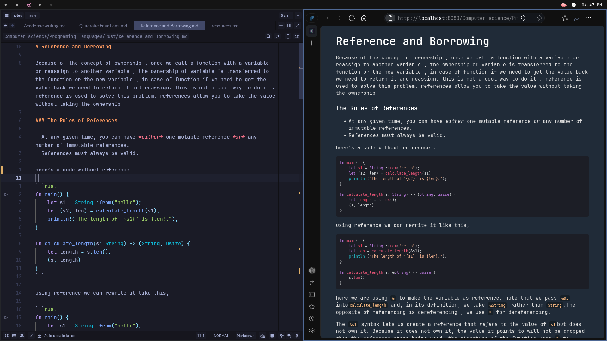

# Mindmirror

**Mindmirror** is a minimal static site generator written in **go** and designed for simple and customizable note-taking. It supports standard Markdown, thanks to Goldmark, and offers a variety of features that make note taking straightforward.

### Features
- Render Markdown as a webpage
- Support for existing or custom themes
- Homepage with a file tree structure
- System tray for easy server control (refresh/run)
- Inline and block math rendering
- Image embedding
- Code highlighting and formatting
- And much more!



## Installation

1. Clone the repository and build the application using Go:
    ```sh
    git clone https://github.com/samintejas/mindmirror.git
    cd ./mindmirror/app
    go build
    go install
    ```

2. Copy the example configurations to your config directory:
    ```sh
    mkdir -p ~/.config/mindmirror/
    cp ./mindmirror/examples/config/* ~/.config/mindmirror/
    ```

3. Edit the `mindmirror.yaml` file and specify your notes' location:
    > **Tip:** You can initialize a git repository for your notes and sync them easily using Git!

> Feel free to raise an issue if you need pre-built binaries for your OS!

## Usage

### System Tray Mode

Start the application in system tray mode:
```sh
mindmirror tray &
```

Access mindmirror at localhost:8080 (use -p flag to set your own port)

### using commands

Rebuild your notes.
```
mindmirror clean && mindmirror build
```
Run the server
```
mindmirror run &
```
Access mindmirror at localhost:8080 (use -p flag to set your own port)
